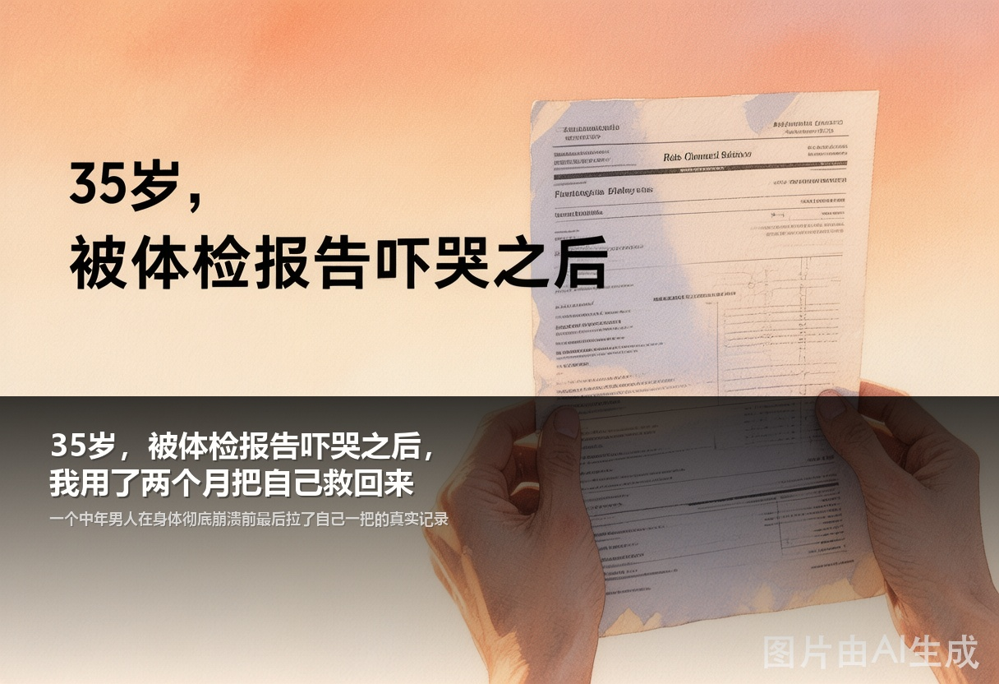
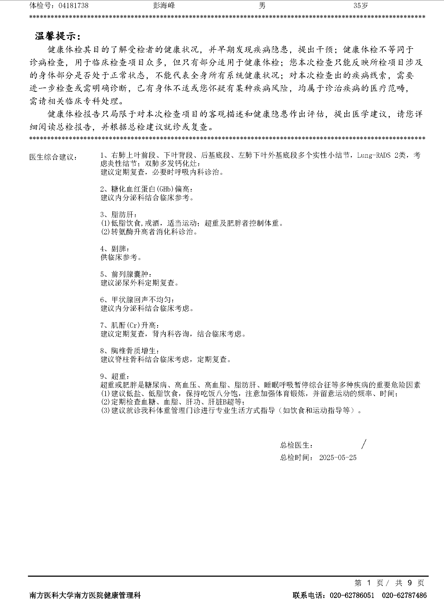
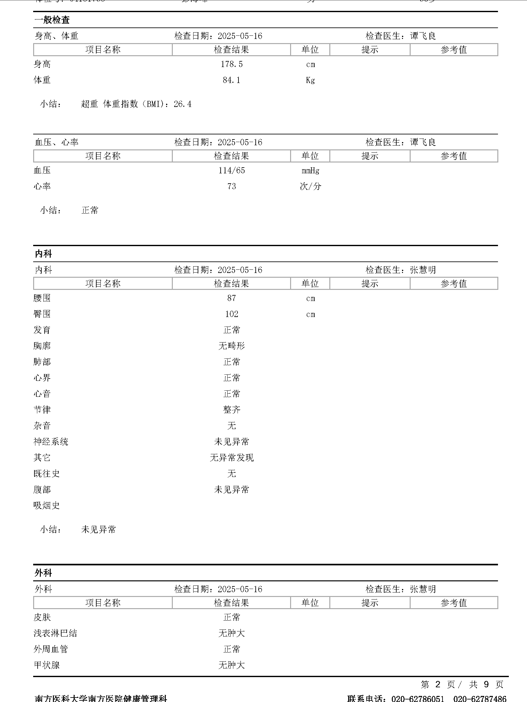
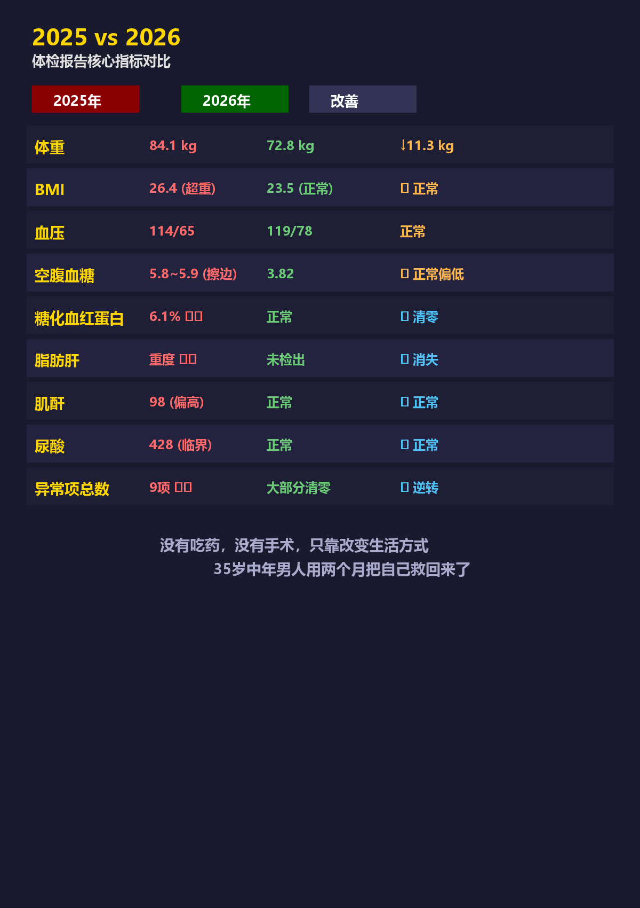
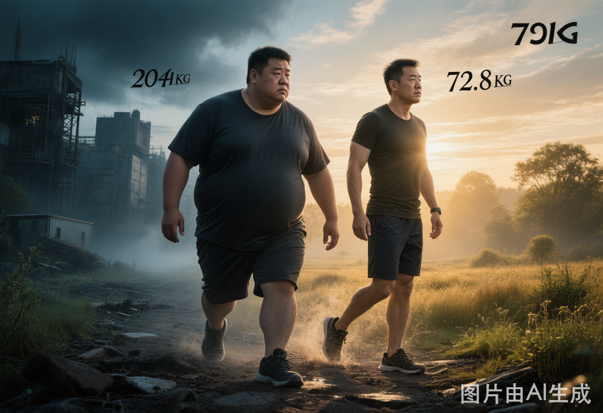

# 35岁，被体检报告吓哭之后，我用了两个月把自己救回来

> 这不是一篇励志文。是一个中年男人，在身体彻底崩溃前，最后拉了自己一把的真实记录。



---

先说说今年2月过年那段时间的事。

那时候我在家里，身体已经不舒服很长一段时间了，但一直忍着没当回事。

大脚拇指关节开始疼。走路疼，不动也隐隐作痛。我上网查了一下，心里咯噔一下——这太像痛风了。

然后就是口臭，特别严重的那种，不管怎么刷牙都消不掉。网上说，口臭可能跟糖尿病有关。

还有尿。每次上厕所，尿液里的泡沫多到吓人，冲都冲不散。这个我再熟悉不过了，我爸有糖尿病，他的尿也是这样。

三个症状一起出现的时候，我慌了。

是真的慌了。

那几天我表面上还在正常过年，走亲戚、吃吃喝喝，但心里面一直在打鼓。晚上躺床上睡不着，脑子里反复想一件事：如果我真的是糖尿病，怎么办？

我才35岁。孩子还小。上面的父母年纪越来越大。老婆一个人扛不起这个家。

我不敢去医院检查。

听起来很怂是吧？但当时的状态就是这样。明知道要出大问题，就是不敢去面对，不敢去查，怕一查就是不可逆的。好像不去医院，那些问题就不存在一样。

这种鸵鸟心态，我维持了大概一个多星期。


后来有一天晚上，我翻出了去年的体检报告。

2025年5月的报告，我随手翻了几页就停住了。

**84.1公斤，BMI 26.4，超重。**

**重度脂肪肝。**

**糖化血红蛋白6.1%，已经触到了糖尿病前期的那条红线。**

**肌酐偏高，尿酸428，已经在边缘徘徊。**

还有淋巴细胞偏低、红细胞分布宽度异常、肺结节、甲状腺回声不均匀……

数了数，**异常项，9个。**



去年拿到这份报告的时候，我也曾经下定决心要改变。我跟自己说，不能再这样下去了，要加强运动，要控制饮食。

然后呢？

然后就没有然后了。

人就是这样，身体没真出问题之前，什么决心都是假的。懒，馋，侥幸。今天太累了明天再说，同事叫聚餐不去不好意思，反正一年后再体检也差不到哪去。

结果真的应了那句话：常在河边走，哪有不湿鞋。

我看着报告上那些红色的箭头，一个一个看过去。再把手机打开，看了看自己最近的症状。

大脚拇指疼——尿酸高，痛风前兆。
严重口臭——血糖高，酮体代谢异常。
泡沫尿——肾脏开始拉警报，蛋白尿可能已经出现了。

脂肪肝、糖尿病、高尿酸，这些代谢病在我身上像一个连环炸弹，一个接一个地被引爆。遗传的糖尿病风险加上自己十几年胡吃海喝攒下的烂账，终于到了还债的时候了。

我关上灯，在床上躺了很久。

脑子里反反复复想的就是一句话：**你没了，这个家怎么办？**

上有老，下有小。父母年纪大了，身体也在走下坡路。孩子还在上幼儿园。房贷还在还。

我没有倒下的资格。

那天晚上我做了决定——不去想那些虚的，不管用什么方法，一定要在身体彻底崩盘之前，把自己救回来。

```

翻完报告之后的那一个星期，我几乎把所有能查的资料都翻了个遍。

以前觉得减肥就是少吃多动，四个字说起来容易做起来难。但这次我是真的被吓到了，所以看得特别认真。

最后我给自己定了两个方案，一个是16+8间歇性断食，一个是午餐换成燕麦。

16+8的操作很简单，就是每天只在8小时内吃饭，剩下的16小时只喝水。我的窗口定在早上8点到下午4点。

午餐方面，我把公司食堂的米饭换成了纯燕麦。就是那种配料表里只有「燕麦」两个字的传统燕麦片，什么都不加。

搭配就是一勺燕麦加200ml纯牛奶，再放几颗坚果碎，一个水煮蛋。

下午4点以后，什么都不吃了。

运动方面我没给自己定什么大目标。让我每天去健身房，三天必跪。我只做了一件事：**下班提前两站下地铁，走回去。**

大概3.5公里，40分钟左右。

```



从3月6号正式开始执行第一天起，我就用AI工具做了一个饮食运动记录表。每天记，一天不落。

这是我当时头几天的真实记录：

| 日期 | 体重 | 早餐 | 午餐 | 晚餐 | 运动 | 执行评分 |
|:---:|:---:|:---|:---|:---|:---|---:|
| 3/6 周五 | 84.75kg | 豆浆、蒸玉米、鸡蛋 | 半碗米饭、两荤一素 | 未进食(两粒坚果) | 步行3公里·43分钟 | 4/5 |
| 3/7 周六 | — | 蒸饺5个、水煮蛋2个 | 杂粮饭、排骨炖玉米、青菜 | 青菜、水煮蛋、排骨2块 | 八段锦40分钟 | 4/5 |
| 3/9 周一 | 83.75kg | 水煮蛋、面包、蒸玉米、豆浆 | 首次燕麦餐(水量过多失败) | — | 午间散步30分钟+晚间步行4.2公里 | 5/5 |
| 3/10 周二 | 83.5kg | 水煮蛋2个、牛肉饼、包子、豆浆 | 燕麦+200ml纯牛奶(成功！)+水煮蛋 | 未进食 | 午间散步50分钟+晚间步行 | 4/5 |
| 3/11 周三 | — | 牛肉饼、水煮蛋2个、蒸玉米、豆浆 | 燕麦牛奶坚果餐 | 四川小面(情绪崩溃) | 晚间步行4公里·60分钟 | 3/5 |

最难过的是3月11号那天。

那天工作上的事情搞得我非常烦躁，情绪差到极点。下班走在路上，满脑子只有一个念头——我想吃东西。

我平时最爱吃的那家川菜面馆就在回家的路上。我站在门口，手机屏幕上是AI助手给我发的今天的饮食记录页面，胃里在叫，脑子里一个声音说"今天就破个例吧"。

另一个声音说：**你上半辈子就是被「明天再说」给毁了的。**

我在门口站了大概整整两分钟，最后还是推门进去了。

吃了一碗四川小面。

那天晚上回去，我在记录表上给自己打了3分。并且在感受栏里写了一句话：「情绪是执行计划最大的敌人。」

第二天我重新回到燕麦餐的节奏里。

从那天之后，我再也没有在进食窗口之外吃过任何东西。因为我知道，一次破例就会有第二次，有了第二次，这个计划就废了。

```

大概到了第三周，真正的考验来了。

前两周体重掉得挺欢的。从84.75到83.5，再到83.1，一斤一斤地往下走，我心里还挺美。

然后平台期到了。

连着好几天，体重卡在83公斤上下，不动了。

这个阶段是最容易放弃的。你会发现身体好像在跟你对着干——你明明吃得少了、动得多了，秤上的数字就是不给你正反馈。

很多人的减脂计划就是死在这里的。不是方法错了，是没撑过去。

我没有放弃，是因为3月16号发生了一件事。

那天跟老婆去看新房。开发商说先交5万块冻结资金就能锁定折扣，不买随时退。

我打开手机银行看了看余额。

**5万块，我一次性拿不出来。**

35岁，工作十年，5万块都没有。

那一刻我脑子里的想法很复杂。不是单纯的自责，也不是羞愧，而是一种很清晰的感觉：**身体在崩，钱包在空，人过中年，我两头都踩空了。**

如果连健康这个最基本的底盘都保不住，那就真的什么都没了。

从那天起，我再也没有犹豫过。

```

三个月后，2026年5月，我再次走进了体检中心。

这一次的数据，连我自己都有点不敢相信：

**体重：72.8公斤**
**BMI：23.5，进入了正常范围**
**血压：119/78**
**空腹血糖：3.82（参考值是4.1-5.9，偏低反而是好信号）**
**肝功能：各项正常**
**血脂：正常**

去年那9项异常，大部分清零了。

脂肪肝没了。血糖稳了。尿酸正常了。肌酐正常了。体重降了11.3公斤。



我没有吃过一粒药，没有做过任何手术，甚至没有请过一天假。每天做的事就是那一套——8小时内吃饭，午餐吃燕麦，下班多走两站路。

拿到体检报告那天，我在医院门口站了很久。

不是激动，是后怕。

如果去年我没有拿到那9项异常的体检报告；
如果2月份身体报警的时候我选择了继续鸵鸟；
如果3月11号那碗面之后我决定「算了」；
如果3月16号那天没有当头一棒——

我不知道今天的我会在哪。

大概还是那个84公斤、脂肪肝、血糖擦边的中年男人，一边焦虑一边继续吃，等着身体真正出问题的那一天。

```



写这篇东西，不是为了证明我有多厉害。

11.3公斤在减脂圈不算什么。我就是个普通的中年打工人，没有私教，没有营养师，连像样的运动时间都没有。

但我做到了。

而且我做的方式，是任何一个上班族都能做到的。

我不是什么健康专家。我只是把自己的经历写出来——一个35岁的普通男人，被体检报告和身体症状联手逼到悬崖边上，用最笨的方法把自己拉回来了。

如果你也到了30多岁，体重超标，体检报告上挂着一堆异常项，每次都说「明天开始减肥」——

听我一句劝。

**不要在身体真的出问题的时候才开始。**

我等到了身体报警才醒悟。你有机会比我先到。

把吃饭的时间压缩到8小时内。
把精米白面换成燕麦杂粮。
每天多走半小时路。

然后，坚持两个月。

就两个月。

看看你拿到明年体检报告的时候，脸上是什么表情。

---

以上，既然看到这里了，如果觉得不错，随手点个赞、在看吧。

谢谢你看完我的故事。

我们，下次再见。

> / 作者：一个不想透露姓名的中年男人
